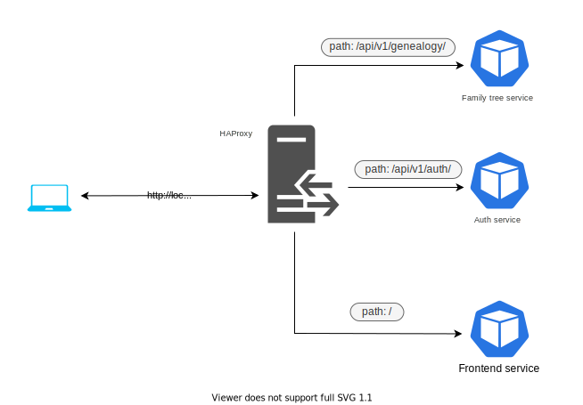

# Table of Contents

1.  [Family Tree IO Project](#org09f5083)
    1.  [usage](#org1f9838b)
    2.  [development](#org6314400)
    3.  [testing](#org706e908)
    4.  [api documentation](#org171b4f1)
    5.  [Technologies](#org1152ff0)
    6.  [TODO](#org98fe16b)

# Family Tree IO Project

A feature-rich web application that <del>is</del> will be designed for creating family trees. <del>User-friendly ui design with many functionalities</del>.

## usage

Below is an instruction how to set up an environment for local development. I case you do not have docker installed on your machine - check [docker](<https://www.docker.com/>).

Rust Dockerfiles use docker buildkit, so it has to be set as env variable \`DOCKERBUILDKIT\`

    export DOCKER_BUILDKIT=1

**You have to be in a root directory of the project, in order for the context to be correct.**

Build provided images and start services with one command.
Choose one of the following commands depending on the needed environment.

-   Dev 
    
        docker-compose -f docker-compose.yaml -f docker-compose.dev.yaml up -d --build
-   Prod
    
        docker-compose up -d --build

Assuming the builds haven&rsquo;t failed, check whether neccessary containers/services are already up, it may take some time.

    docker-compose ps

### troubleshooting

-   Custom images had been built successfully however `docker-compose up -d --build` failed
    -   Ensure that ports used in the project are not already allocated
    -   Ensure being in the correct directory
-   Building an image has failed
    -   Create a ticket on clickup with an explanation of the situation (maybe error trace) and assign it to the image contibutor. Alternatively you can directly contact that person
-   A container keeps restarting
    -   Check logs of the pod with `docker logs <name-of-the-container>`
    -   Create a ticket on clickup with an explanation of the situation (maybe error trace from logs)

## development

First of all, in order to access any kind of service it&rsquo;s recommended to request port \`80\`. Backend apis are not accessible directly outside of the docker vnet. Direct access (via exposed 3000 port) to react frontend service will be probably removed in the nearest future, because using it causes CORS issues.

### Paths

-   Frontend - `http://${host}:${haproxy_port}/`
-   Auth Api - `http://${host}:${haproxy_port}/api/v1/auth`
-   Genealogy Api - `http://${host}:${haproxy_port}/api/v1/genealogy`

By default `host=localhost` and `haproxy_port=80` (if haproxy uses default port, specifying port in http requests is redundant)

Currently paths for specific services are also presented on the diagram below

## testing

### integration tests

For these type of tests we used [Pytest](<https://docs.pytest.org/en/6.2.x/>)  alongside with docker-compose which sets up the environment
Location of the tests - <./integration_tests>

1.  How to run:

    You can use virtual environment (recommended)
    
    Install dependencies 
    
        pip install -r integration_tests/requirements.txt
    
    Being in the project root directory start tests with one of the command below
    
    -   Create new infrastructure for the tests (make sure project containers are down)
        
            python -m pytest integration_tests \
            --docker-compose=docker-compose.yaml
    
    -   Use existing infrastructure (not recommended though, may cause duplicates in database)
        
            python -m pytest integration_tests \
            --docker-compose=docker-compose.yaml --docker-compose-no-build \
            --use-running-containers

## api documentation

Interactive documentation of the api can be found at [<http://{host}:{port}/api/docs>](<http://localhost/api/docs>)

## Technologies

### Frontend

-   React.js
-   Typescript
-   Styled Components
-   libraries
    -   [React-family-tree](<https://www.npmjs.com/package/react-family-tree>)
    -   react-toastify
    -   axios

### Backend

-   Rust
-   Actix-web

### Database

-   Postgresql

### Infrastructure

-   Docker
-   k8s
-   helm

### Testing

-   Units
    -   Rust
    -   React testing library
-   Integration
    -   Pytest
-   e2e
    -   cypress

## TODO

-   <del>set up travis ci</del>
-   <del>create basic front setup</del>
-   <del>create basic actix setup</del>
-   <del>create docker-compose for easier local development - temporary solution</del>
-   visualization
-   dragging elements
-   multimedia attachments (mostly images)
-   recognizing different relations between indiviuals
-   time frame of the relationship
-   biographical informations
-   a posibility to export the tree to HTML, PDF
-   read/write the tree from/to json
-   <del>persistent trees, with the help of a database</del>
-   <del>user authentication service</del>

